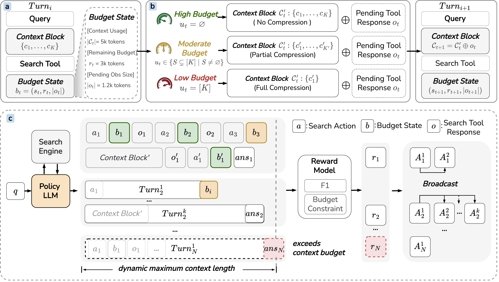

<div align="center">

# ContextBudget: Budget-Aware Context Management for Long-Horizon Search Agents

[]([https://arxiv.org/abs/xxxx.xxxxx](https://arxiv.org/abs/2604.01664v1))
[](LICENSE)
[](https://www.python.org/downloads/)

**Enabling LLM agents to perform long-horizon reasoning under explicit context-window budgets**

</div>

---

## 📋 Table of Contents

- [Overview](#overview)
- [Method](#method)
- [Results](#results)
- [Installation](#installation)
- [Quick Start](#quick-start)
- [Evaluation](#evaluation)
- [Project Structure](#project-structure)
- [Citation](#citation)

---

## Overview

**ContextBudget** formulates context management as a budget-constrained sequential decision problem, enabling LLM agents to dynamically allocate context capacity based on remaining budget. The framework introduces explicit budget-awareness signals that allow agents to determine:

- **When** to compress
- **How much** to compress
- **Which** information to preserve

---

## Method

### Budget-Aware Agent Loop

The framework introduces explicit budget-awareness signals that enable agents to assess available budget before incorporating new observations and make adaptive compression decisions.

<div align="center">



</div>

### Budget-Constrained RL (BACM-RL)

- **Progressively Tightened Budget Curriculum**: Training budget gradually tightens from 8k to 4k tokens across 5 stages
- **Overflow-Sensitive Regularization**: Penalizes budget violations
- **End-to-End Optimization**: Directly aligns compression strategies with task success

---

## Results

### BrowseComp-Plus (LLM-as-Judge)

| Method | Context | Easy | Mid | Hard | Avg |
|--------|---------|------|-----|------|-----|
| Qwen3-235B | 128k | 0.380 | 0.164 | 0.034 | 0.136 |
| MEM1 (7B) | 8k | 0.040 | 0.044 | 0.015 | 0.035 |
| **BACM-RL (7B)** | 8k | **0.420** | **0.146** | **0.031** | **0.127** |
| MEM1 (30B) | 8k | 0.360 | 0.141 | 0.069 | 0.131 |
| **BACM-RL (30B)** | 8k | **0.520** | **0.164** | **0.042** | **0.147** |

### Multi-objective QA (F1 Score)

| Method | Context | 2-Obj | 8-Obj | 16-Obj | 32-Obj |
|--------|---------|-------|-------|--------|--------|
| MEM1 (7B) | 8k | 0.838 | 2.345 | 2.391 | 1.210 |
| **BACM-RL (7B)** | 8k | **0.909** | **2.790** | **4.011** | **2.938** |
| MEM1 (30B) | 8k | 0.978 | 1.327 | 1.383 | 0.909 |
| **BACM-RL (30B)** | 8k | **1.032** | **3.587** | **6.255** | **4.545** |

**Key Findings**:
- ✅ **1.6× improvement** in high-complexity (32-objective) settings
- ✅ **5.0× improvement** over MEM1 in 32-objective regime
- ✅ **30B with 8k > 235B with 128k** on BrowseComp-Plus

---

## Installation

```bash
# Clone repository
git clone http://gitlab.alibaba-inc.com/business_ai/ContextBudget.git
cd ContextBudget

# Create environment
conda create -n budget python=3.10
conda activate budget

# Install verl framework
cd verl
pip install -e .

# Install dependencies
pip install pandas datasets transformers accelerate pyserini faiss-gpu uvicorn fastapi
```

**Optional: Setup Retrieval Environment**

```bash
conda create -n retriever python=3.10
conda activate retriever
conda install pytorch==2.4.0 pytorch-cuda=12.1 -c pytorch -c nvidia
pip install transformers datasets pyserini faiss-gpu uvicorn fastapi
```

---

## Quick Start

### 1. Data Generation

```bash
cd gen_data

# Generate raw data
bash get_raw.sh --batch_size 5

# Process training data
python gen_main_train.py \
    --data_root ./data_all_raw_train \
    --dirs nq_hotpotqa_train_multi_1 \
    --out_root processed_data_train \
    --sample_n 256 \
    --seed 42
```

### 2. Training

```bash
cd verl/train

# Configure paths
DATA_DIR="/path/to/processed_data_train/nq_hotpotqa_train_multi_1"
BASE_MODEL="/path/to/Qwen2.5-7B-Instruct"
PROJECT_NAME="ContextBudget"
EXPERIMENT_NAME="BACM"

# Run training with budget curriculum
bash bacm_train_debug.sh
```

**Training Script**: `verl/train/bacm_train_debug.sh`

---

## Evaluation

### 1. Start Servers

```bash
cd eva

# Start SGLang server
export MODEL_PATH="/path/to/your/model"
./experiments/sglang_server.sh

# Start retrieval server
./retrieval/run_retrieval_server_wiki.sh
```

### 2. Run Inference

```bash
# Multi-objective QA
MODEL_PATH="/path/to/contextbudget_model"

./experiments/infer_nq_hotpotqa_single.sh \
    --model_path "$MODEL_PATH" \
    --agent_type branch_loop \
    --dataset nq_hotpotqa \
    --max_depth 10 \
    --target 2 \
    --output ./outputs/mq_ours_t2.jsonl

# BrowseComp-Plus
./experiments/infer_bc_single.sh \
    --model_path "$MODEL_PATH" \
    --agent_type branch_loop \
    --dataset bc \
    --max_depth 10 \
    --target 1 \
    --output ./outputs/bcp_ours.jsonl
```

### 3. Evaluate Results

```bash
# Multi-objective QA
python3 ./modules/evaluate_mq.py \
    --input_jsonl ./outputs/mq_ours_t2.jsonl \
    --tokenizer_path "$MODEL_PATH" \
    --target 2

# BrowseComp-Plus
export MODEL_PATH="/path/to/qwen3-32B"
./experiments/sglang_server.sh
./experiments/run_llm_judge.sh \
    --input-dir ./outputs \
    --output-dir ./outputs/judged
```

### Datasets & Metrics

| Task | Datasets | Metrics |
|------|----------|---------|
| Multi-objective QA | NQ, HotpotQA, TriviaQA, PopQA, 2WikiMultiHopQA, Musique, Bamboogle | F1, EM, Token Cost |
| BrowseComp-Plus | BrowseComp-Plus | LLM-as-Judge |

---

## Project Structure

```
ContextBudget/
├── pic/                          # Figures
│   ├── pipeline.png              # Framework overview
│   └── banner.png                # Project banner
├── eva/                          # Evaluation framework
│   ├── modules/                  # Evaluation modules
│   ├── experiments/              # Inference scripts
│   └── retrieval/                # Retrieval server setup
├── gen_data/                     # Data generation
│   ├── gen_main_train.py        # Training data
│   ├── gen_main_test.py         # Test data
│   └── get_raw.sh               # Raw data download
└── verl/                         # Core framework
    ├── train/
    │   ├── bacm_train_debug.sh # Training script
    │   ├── configs/             # Configurations
    │   └── reward_score/        # Reward functions
    └── verl/experimental/agent_loop/  # Agent implementations
```

---

## Citation

```bibtex
@misc{wu2026contextbudgetbudgetawarecontextmanagement,
      title={ContextBudget: Budget-Aware Context Management for Long-Horizon Search Agents}, 
      author={Yong Wu and YanZhao Zheng and TianZe Xu and ZhenTao Zhang and YuanQiang Yu and JiHuai Zhu and Chao Ma and BinBin Lin and BaoHua Dong and HangCheng Zhu and RuoHui Huang and Gang Yu},
      year={2026},
      eprint={2604.01664},
      archivePrefix={arXiv},
      primaryClass={cs.AI},
      url={https://arxiv.org/abs/2604.01664}, 
}
```

---

## License

Apache License 2.0

---

<div align="center">

**[⬆ Back to Top](#contextbudget-budget-aware-context-management-for-long-horizon-search-agents)**

</div>
